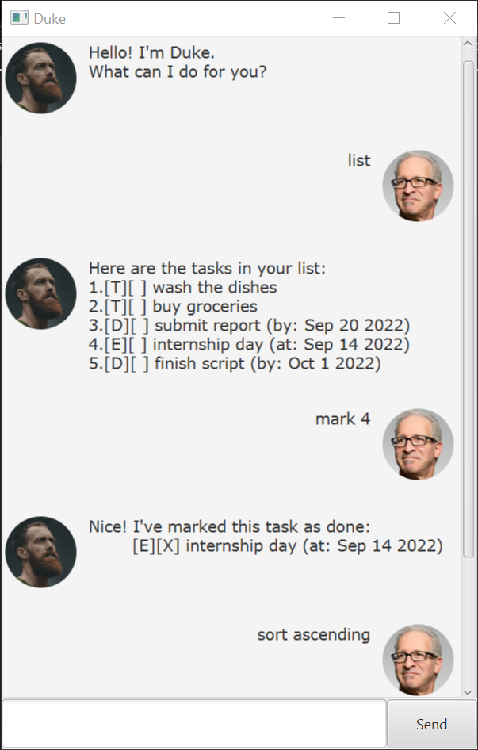

# User Guide

Duke is a **chatbot desktop app for managing tasks, optimized for use via a command line interface** (CLI) while still
having the benefits of a Graphical User Interface (GUI). If you can type quickly, Duke can manage your tasks faster than
traditional GUI apps.

- [Quick Start](#quick-start)
- [Features](#features)
    - Adding a task
        - [Adding a todo : `todo`](#adding-a-todo--todo)
        - [Adding a deadline : `deadline`](#adding-a-deadline--deadline)
        - [Adding an event : `event`](#adding-an-event--event)
    - [Marking a task as finished : `mark`](#marking-a-task-as-finished--mark)
    - [Marking a task as unfinished : `unmark`](#marking-a-task-as-unfinished--unmark)
    - [Listing all tasks : `list`](#listing-all-tasks--list)
    - [Sorting the tasks by date : `sort`](#sorting-the-tasks-by-date--sort)
    - [Deleting a task : `delete`](#deleting-a-task--delete)
    - [Exiting the program : `bye`](#exiting-the-program--bye)
    - [Saving the data](#saving-the-data)
    - [Editing the data file](#editing-the-data-file)

## Quick Start
1. Ensure that you have Java 11 or above installed in your computer.
2. Download the latest Duke.jar from [here](https://github.com/Rachel-AG/ip/releases).
3. Copy the file to the folder you want to use as the home folder for your Duke chatbot.
4. Double-click the file to start up the app.
5. Type the command in the command box and press Enter on your keyboard or click the Send button to execute the command.
6. Some example command to start with:
    - `todo add tasks to Duke`: adds a todo.
    - `list`: list down all tasks you have.
7. Refer to the [Features](#features) section below for details of available command.

## Features
> Notes regarding the command format:
> - Words in `UPPER_CASE` are the parameters to be supplied by the user.\
    > e.g. in `todo TODO_DESCRIPTION`, `TODO_DESCRIPTION` is a parameter which can be used as `todo buy grocery`.
> - If a parameter is expected only once in the command, but you specified it multiple times,
    command will not be executed by Duke.\
    > e.g. `mark 1 2` will not be executed.
> - Extraneous parameters for commands that do not take it parameters will not be executed by Duke.\
    > e.g. `list 1` will not be executed.

### Adding a todo : `todo`
Adds a todo to the task list.\
**Format:** `todo TODO_DESCRIPTION `\
**Example:** \
`todo wash dishes` \
`todo pay rent`

### Adding a deadline : `deadline`
Add a deadline to the task list. A deadline must contain a description and a due date.\
**Format:** `deadline DEADLINE_DESCRIPTION /by DUE_DATE` 

> _DUE_DATE_ : The due date of the deadline must be in yyyy-mm-dd format. 

**Example:** \
`deadline submit Quiz 1 /by 2022-12-15` \
`deadline finish Assigment 2 /by 2022-05-08`

### Adding an event : `event`
Add an event to the task list. An event must contain a description and a date. \
**Format:** `event EVENT_DESCRIPTION /at DATE` 

> _DATE_ : The date of the event must be in yyyy-mm-dd format. 

**Example:** \
`event Christmas celebration /at 2022-12-15` \
`event Food Festival /at 2022-05-08`

### Marking a task as finished : `mark`
Marks the task selected as finished. \
**Format:** `mark TASK_INDEX` 

> _TASK_INDEX_ : the index of the task in the task list which can be obtained with the list command. 

**Example:** \
`mark 1` \
`mark 3`

### Marking a task as unfinished : `unmark`
Marks the task selected as unfinished. \
**Format:** `unmark TASK_INDEX` 

> _TASK_INDEX_ : the index of the task in the task list which can be obtained with the list command. 

**Example:** \
`unmark 2` \
`unmark 5`

### Listing all tasks : `list`
Shows a list of all saved tasks. \
**Format:** `list`

### Sorting the tasks by date : `sort`
Sorts the task list by date. \
**Format:** `sort DIRECTION` 

> _DIRECTION_: `ascending` / `descending` 

**Example:** \
`sort ascending` \
`sort descending`

### Deleting a task : `delete`
Deletes the selected task in the list. \
**Format:** `delete TASK_INDEX` 

> _TASK_INDEX_ : the index of the task in the task list which can be obtained with the list command. 

**Example:** \
`delete 1` \
`delete 5`

### Exiting the program : `bye`
Exits the program. \
**Format:** `bye`

### Saving the data
Duke data are saved in the hard disk automatically after any command that changes the data is executed. There is no need
to save manually.

### Editing the data file
Duke data are saved as text file `[JAR_file_location]/data/duke.txt`. Advanced users are welcome to update the data
directly by editing the data file.

> CAUTION: If your changes to the text file make its format invalid, Duke may crash.
